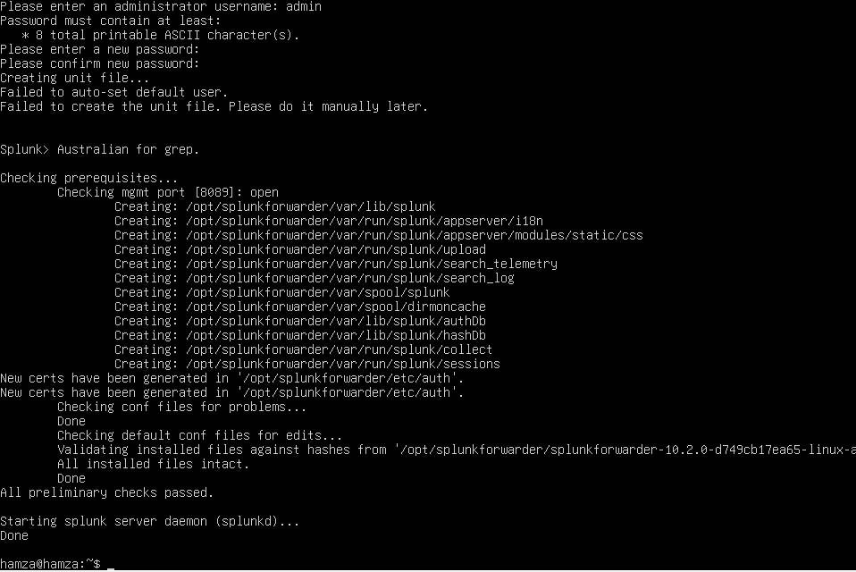
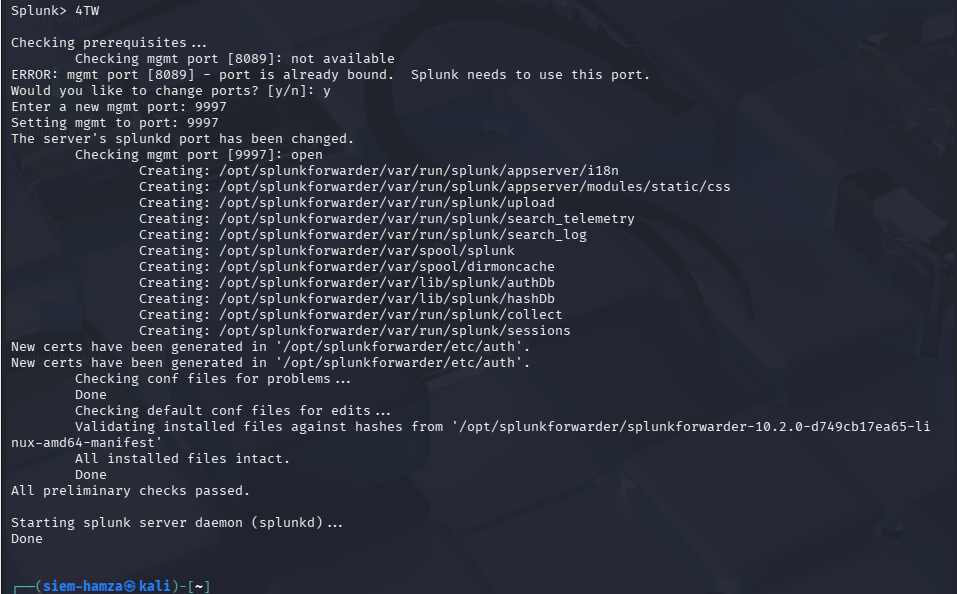
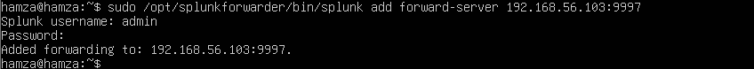
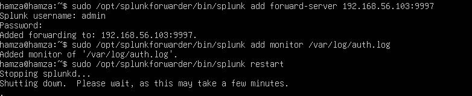
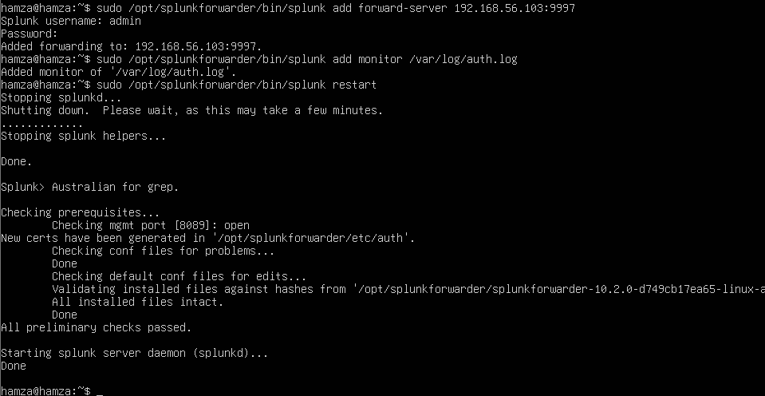

# Splunk SSH Brute Force Detection Lab

## Overview

This project demonstrates how a Security Operations Center (SOC) can detect SSH brute force attacks using Splunk SIEM.

The lab simulates a real-world attack scenario where an attacker performs multiple SSH login attempts against a Linux server. Authentication logs are forwarded to Splunk for analysis and detection.

---

## Lab Architecture

- **Attacker:** Kali Linux
- **Victim:** Ubuntu Server
- **SIEM:** Splunk Enterprise

**Attack flow:**  
Kali Linux (Hydra) → Ubuntu Server (`/var/log/auth.log`) → Splunk SIEM

---

## Tools Used

- Splunk Enterprise
- Splunk Universal Forwarder
- Hydra
- Kali Linux
- Ubuntu Server
- VirtualBox

---

## 1. Splunk Universal Forwarder Installation

The Splunk Universal Forwarder was installed and initialized on the Ubuntu server to forward authentication logs to the Splunk SIEM.



---

## 2. Splunk Forwarder Port Configuration

During the first startup, the default Splunk management port was already in use. A new port was configured so the forwarder could start correctly.



---

## 3. Adding the Splunk Forward Server

The Ubuntu server was configured to forward logs to the Splunk SIEM server.



---

## 4. Adding Authentication Log Monitoring

The Splunk Universal Forwarder was configured to monitor the Ubuntu authentication log file.



---

## 5. Full Forwarder Configuration

After adding the forward server and monitoring the authentication log, the forwarder was restarted successfully.



---

## 6. SSH Brute Force Attack Simulation

The attack was simulated from a Kali Linux machine using Hydra.

**Command used:**

```bash
hydra -l ubuntu -P /usr/share/wordlists/rockyou.txt ssh://192.168.56.105

7. Live Monitoring of Ubuntu Authentication Logs

During the brute force attack, the Ubuntu server recorded failed SSH login attempts in real time.

8. Ubuntu Authentication Log Evidence

The /var/log/auth.log file clearly shows repeated failed login attempts from the attacker machine.

9. Detection in Splunk

The forwarded logs were successfully indexed in Splunk. Failed SSH login attempts were detected using the following SPL query:

index=main "Failed password"

MITRE ATT&CK Mapping

Technique: T1110 - Brute Force

Skills Demonstrated

SIEM monitoring

Log analysis

SSH brute force detection

Linux security monitoring

Threat detection

SOC lab design

Author

GitHub: https://github.com/hamzanotcool
